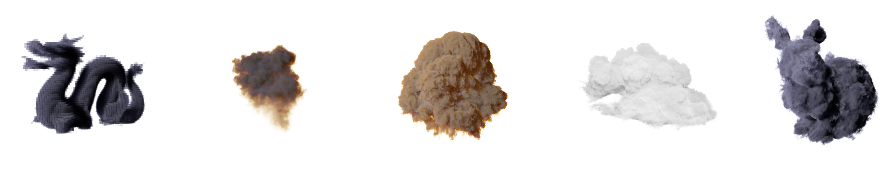

<h1>A Bucket LBVH Construction and Traversal
Algorithm for Volumetric Sparse Data</h1>
Repository containing our implementation in GPU (cuda) and CPU of our paper published at SIBGRAPPI 2020. You can also find a copy of our paper on this repository.

<h2>Installation setup</h2>
<ol>
<li>First install all dependencies using vcpkg</li>
<li>vcpkg install openvdb</li>
<li>vcpkg install cuda</li>
<li>In the file CMakeLists verify if CMAKE_MODULE_PATH and CMAKE_TOOLCHAIN_FILE are pointing towards the correct path of vcpkg</li>
<li>Change the path on RESOURCES_DIR in Texture3D.h to your current folder storing the grids</li>
<li>Compile</li>
</ol>

<h2>Depedencies</h2>
<ul>
<li>GLM</li>
<li>OpenVDB</li>
<li>CUDA</li>
</ul>

<h2>Datasets:</h2>

<a href="https://www.disneyanimation.com/data-sets/?drawer=/resources/clouds/"> Disney clouds.</a> 
<a href="https://www.openvdb.org/download/"> Harvard Dragon, Fireball, Explosion and Bunny cloud.</a>
